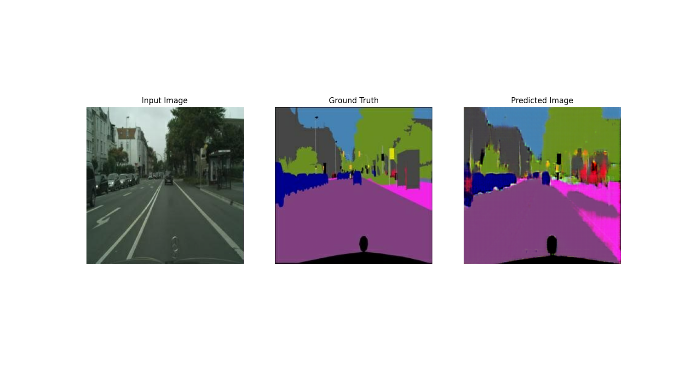
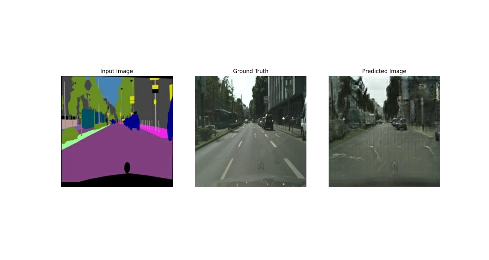

# Pix2Pix - Tensorflow 2
## Getting started
In this quickstart I will explain how to get started with training the basic pix2pix gan in this repository. 
1. [Install CUDA]('https://developer.nvidia.com/cuda-downloads')
2. [Install cuDNN]('https://developer.nvidia.com/cudnn')
3. [Install tensorflow]('https://www.tensorflow.org/install/') (version: 2.8.0-dev20211016)
4. [Download an existing dataset]('https://www.kaggle.com/vikramtiwari/pix2pix-dataset')
5. Clone this repository

If you have followed these steps you need to open the file `pix2pix.py` and change the hardcoded path to the place you have stored your dataset. go inside the folder and next to the `/train` and `/val` folders you should create a folder named `/result`. 

## Training
In this fase of the project there are not a lot of options to pass along yet. By running `python pix2pix.py` in the terminal the network will start training and generating results in the `/result` folder created early.

## Some Results
By switching the in and outputs I was able to generate a network in both directions, the results can be seen below. Both these images are part of the cityscapes dataset. 

#### RGB image to a semantic map

#### Semantic map to RGB

 
